<div align="center">

# 🎓 EduTrack — Intelligent University Academic Platform

**A production-oriented university academic platform in pure Java — records management, exam analytics, scheduling, reporting and a REST API — powered end-to-end by classic data structures & algorithms.**

[](https://openjdk.org/)
[](#tech-stack)
[](#-testing)
[](LICENSE)
[](#-screenshots)
[](#-rest-api)

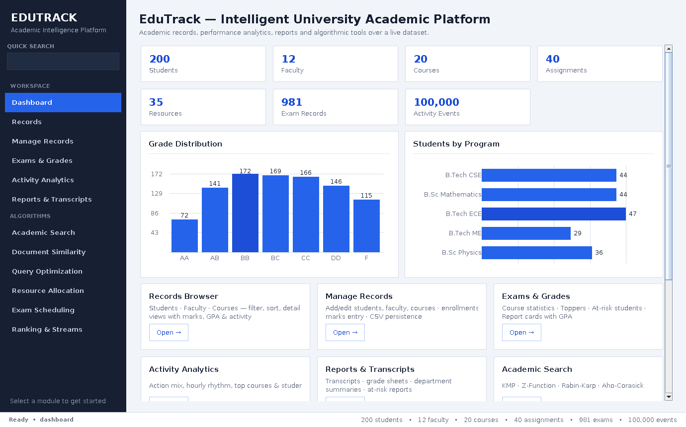

</div>

---

## ✨ What is EduTrack?

EduTrack models a real university academic system — **200 students, 12 faculty, 20 courses, 40 assignments, 981 exam records and a activity event stream** — and answers the questions an academic office actually asks: *Who can teach what? Which exams conflict? Which students are at risk? How similar are two submissions? What's the fastest way to find anything?*

Every answer is computed with a **hand-implemented DSA algorithm** (JDK only), exposed through a modern Swing GUI and a console CLI, persisted to **CSV files**, and exposed to other systems through a **built-in REST API**.

## 🚀 Feature Highlights

| Area | What you get |
|---|---|
| 🗂️ **Records Browser** | Filter/sort students, faculty, courses · detail dialogs with marks, GPA, rank & recent activity · CSV export |
| ✏️ **Manage Records (CRUD)** | Add/remove students, faculty, courses (cascading deletes) · enroll/drop · marks entry with live grade preview · dirty tracking |
| 💾 **CSV Persistence** | Save/load `students.csv`, `faculty.csv`, `courses.csv`, `exams.csv` · one-click reset to generated data |
| 🔎 **Smart Search** | One box searches everything — KMP exact matching, AND multi-term ranking, Levenshtein *did-you-mean* fallback |
| 📊 **Exam Analytics** | Per-course statistics, GPA toppers, at-risk detection, report cards |
| 📈 **Activity Analytics** | activity event stream: actions, hourly rhythm, top courses/students |
| 🧾 **Reports & Export** | Official-style transcripts, grade sheets, department summaries, at-risk lists |
| 🌐 **REST API** | 8 JSON endpoints over JDK's built-in HTTP server — start/stop from the dashboard |
| 🧮 **Algorithm Workbench** | String search, suffix structures, dynamic programming, network flow, scheduling, ranking and streaming algorithms implemented from scratch |

## 🧠 Algorithm Coverage

| Capability | Algorithms | Used for |
|---|---|---|
| **String Algorithms** | KMP · Z-Function · Rabin-Karp · Aho-Corasick | Course/student search, repeated-phrase detection, code lookup, multi-keyword scans |
| **Suffix Structures** | Suffix Array · **SA-IS** (linear) · Kasai LCP · Suffix Automaton | Document indexing, match highlighting, cross-submission similarity |
| **Advanced DP** | Levenshtein · Damerau · Matrix-Chain · Bitmask DP · Optimal BST | Typo-tolerant queries, pipeline optimization, course selection, key organization |
| **Network Flow** | Hopcroft-Karp · Ford-Fulkerson · Edmonds-Karp · Dinic · König | Faculty→course matching, classroom allocation, conflict analysis |
| **NP-Completeness** | DPLL SAT · 3-SAT→CLIQUE · CLIQUE→IND-SET→VERTEX-COVER · VC 2-approx | Exam scheduling, constraint reductions, conflict covering |
| **Randomized & Parallel** | Randomized QuickSort (3-way) · ForkJoin Merge Sort · Reservoir Sampling | CGPA ranking, 1M-record benchmarks, stream sampling |

Every capability has an interactive CLI entry point and a dedicated GUI screen with visualizations such as graph canvases, tree drawings, timetable grids and benchmark charts.

## 🖥️ GUI Gallery

<details open>
<summary><b>Platform screens</b></summary>

**Dashboard** — redesigned home screen with a dark navigation rail, quick search, live dataset statistics, feature cards, algorithm workspaces and the interactive **REST API Server** card.


**Records Browser** — structured, sortable/filterable tables for students, faculty and courses, with detail views for academic records and recent activity.

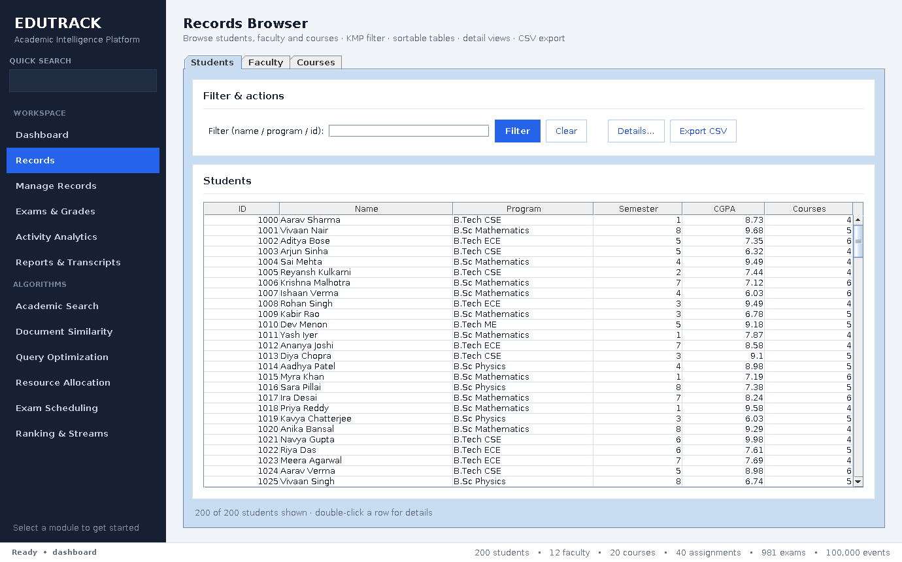

**Manage Records** — a focused CRUD workspace for students, faculty and courses, enrollment changes, marks entry, validation, persistence and reset-to-generated-data controls.

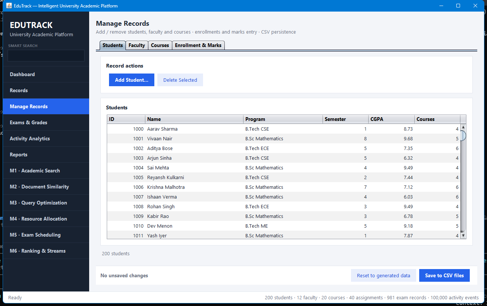

**Exams & Grades** — course statistics, grade-distribution visualization, pass-rate and average charts, GPA ranking, at-risk analysis and report-card actions.

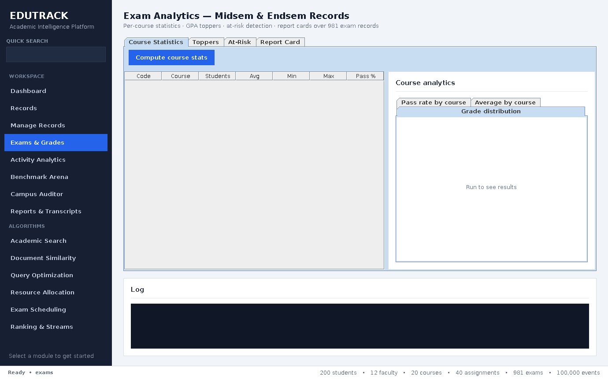

**Activity Analytics** — clearer summary cards and corrected chart scaling for hourly activity, action totals, and top course/student activity without overcrowded labels.

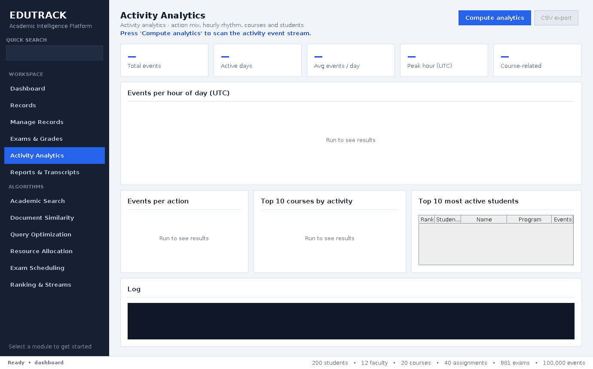

**Reports & Export** — an official-style transcript preview (per-course marks, credits attempted/earned, weighted GPA, stored CGPA, class rank) ready to save as text; grade sheets, department summaries and at-risk lists export as CSV.

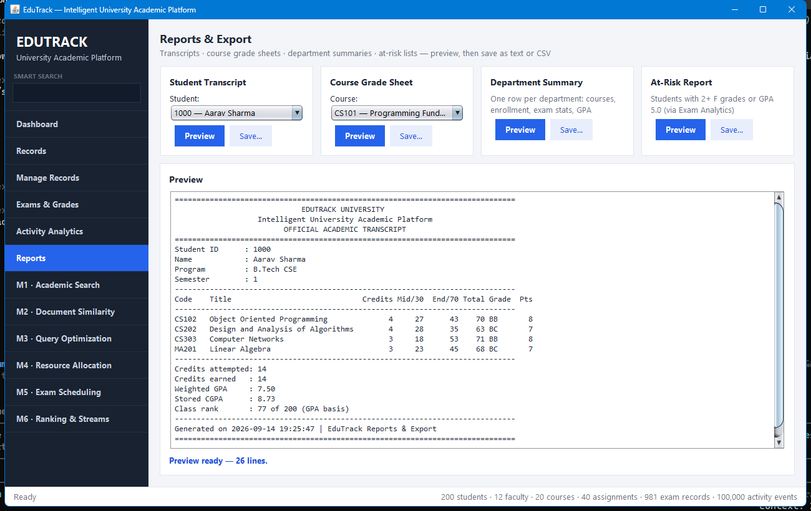

**Smart Search** — ranked results across resources, courses and assignments with exact/prefix matching, multi-term relevance and Levenshtein typo suggestions.

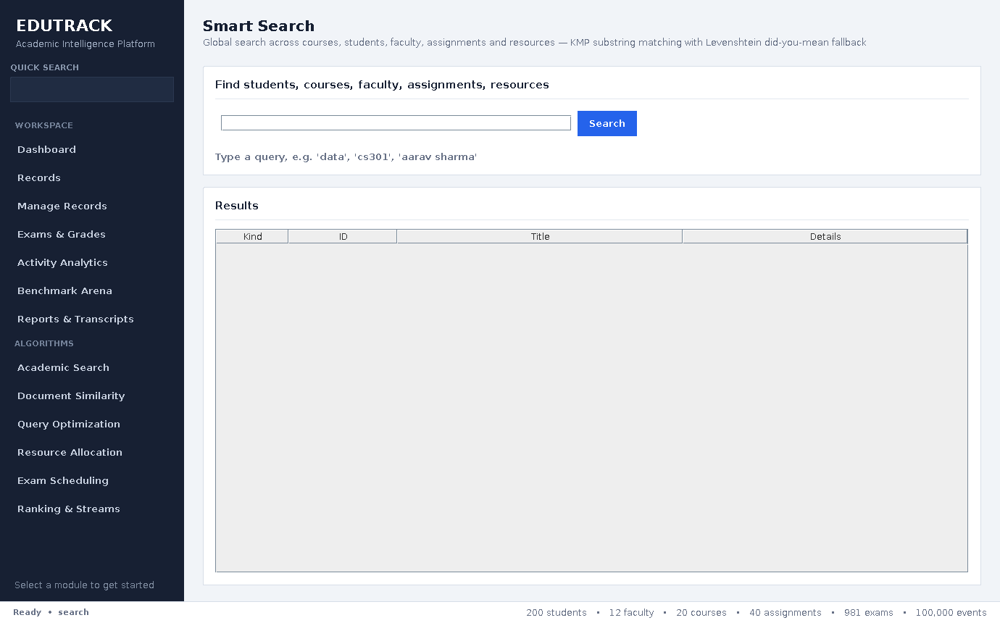

</details>

<details>
<summary><b>Algorithm feature screens</b></summary>

**Academic Search** — KMP, Z-Function, Rabin-Karp and Aho-Corasick workflows presented as an interactive search workspace.

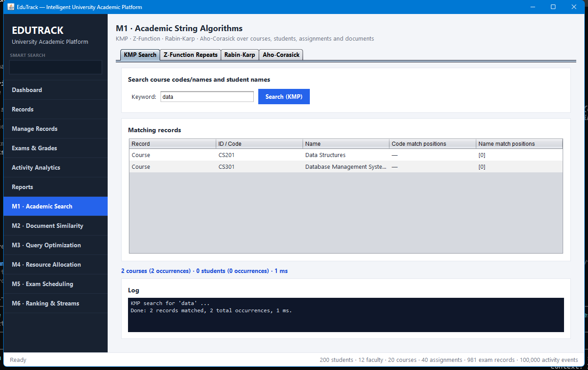

**Document Similarity** — suffix-array indexing, SA-IS, Kasai LCP and suffix-automaton visualizations for document matching and similarity analysis.

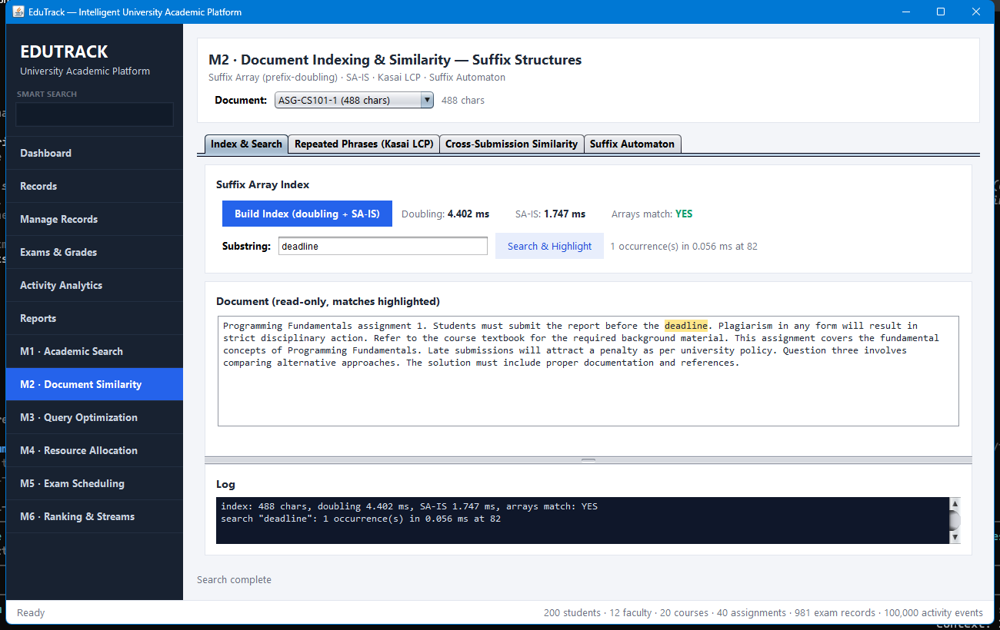

**Query Optimization** — optimal BST construction, Levenshtein/Damerau correction, matrix-chain optimization and bitmask dynamic programming with visual outputs.

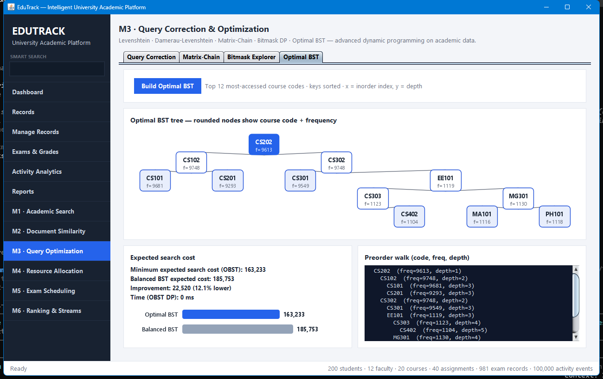

**Resource Allocation** — bipartite matching, König's theorem and max-flow based allocation visualized in one workspace.

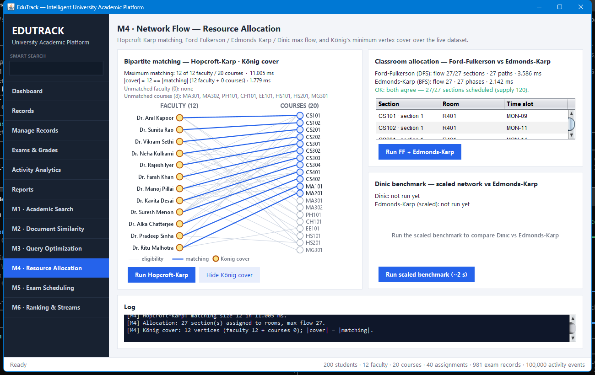

**Exam Scheduling** — constraint-based course scheduling with DPLL, conflict-graph visualization and a generated timetable grid.

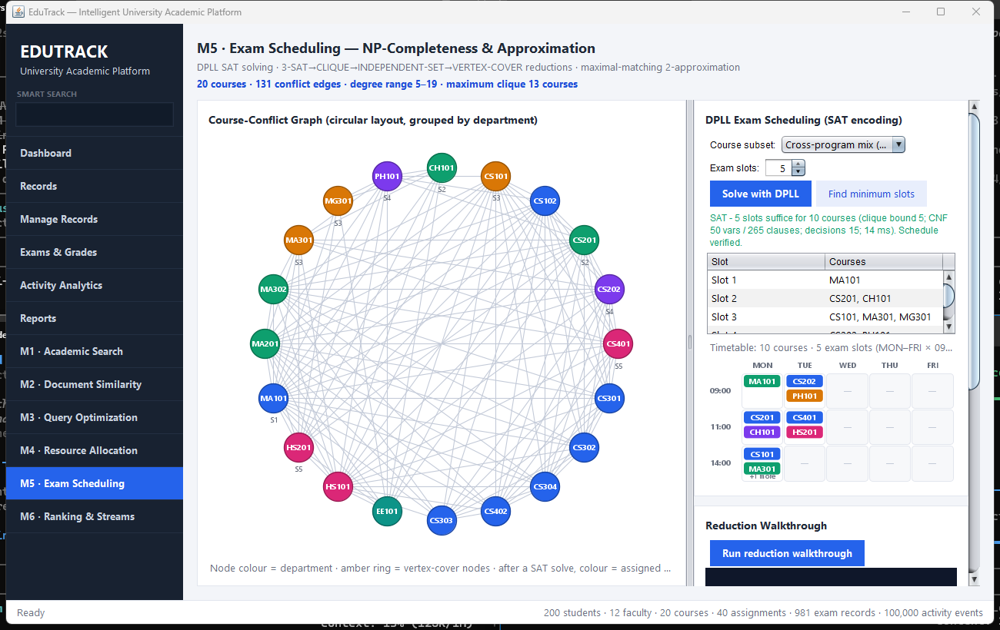

**Ranking & Streams** — CGPA ranking, randomized quicksort, parallel sorting and reservoir sampling with benchmark visualizations.

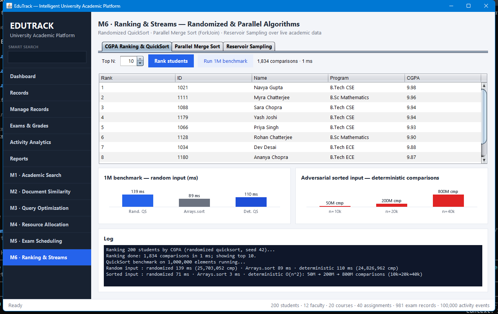

</details>

## ⚡ Quick Start

**Requirements:** JDK 21 or newer. Nothing else.

```bash
# Clone and build
git clone https://github.com/rushmanthnalluri/EduTrack-Intelligent-University-Academic-Platform.git
cd EduTrack-Intelligent-University-Academic-Platform
javac -d bin -sourcepath src src/edutrack/gui/EduTrackGUI.java src/edutrack/EduTrack.java

# Run the GUI
java -cp bin edutrack.gui.EduTrackGUI

# Or run the console app (12-option menu)
java -cp bin edutrack.EduTrack
```

The app ships with a deterministic generated dataset (seed 42). Your edits are saved to `DataSets/*.csv` via **Manage Records → Save to CSV files** and loaded automatically on next start; *Reset to generated data* restores the original.

## 🎨 GUI Design Refresh

The current desktop interface uses a dark navigation rail, stronger card borders, clearer surface hierarchy, improved typography, consistent button states, responsive spacing, sortable tables, and corrected activity-chart label density. Dashboard and analytics views refresh from the live in-memory dataset rather than stale cached values.

## 🌐 REST API

Start from the dashboard's **REST API Server** card or CLI option 10 (default port 8080):

```bash
curl http://localhost:8080/api/summary
curl http://localhost:8080/api/students?id=1000
curl http://localhost:8080/api/courses?code=CS201
curl "http://localhost:8080/api/search?q=data%20structures"
curl http://localhost:8080/api/analytics
```

| Endpoint | Description |
|---|---|
| `GET /api/summary` | Dataset counts + persistence flag |
| `GET /api/students` · `?id=N` | Students; detail adds exam records + weighted GPA |
| `GET /api/courses` · `?code=X` | Courses; detail adds exam statistics |
| `GET /api/faculty` | Faculty with expertise lists |
| `GET /api/exams?studentId=&course=` | Exam records, filterable |
| `GET /api/search?q=…` | Smart-search results with relevance scores |
| `GET /api/analytics` | Activity-stream analytics summary |

Errors return JSON `400/404/405` bodies. Handlers are thread-safe (copy-on-write snapshots).

## 🏗️ Project Structure

```
├── src/
│   ├── modules/                 Shared string matchers (KMP, Rabin-Karp, Z-Function)
│   └── edutrack/
│       ├── EduTrack.java        CLI entry point
│       ├── model/               Student, Faculty, Course, Assignment, Resource, ActivityEvent, ExamRecord
│       ├── data/                DataStore (data + CRUD API) · CsvStore (CSV persistence)
│       ├── modules/             algorithm implementations (CLI + self-test each)
│       ├── features/            RecordQueries · ExamAnalytics · ActivityAnalytics · ManageSupport · ReportGenerator
│       ├── search/              SearchService (global smart search)
│       ├── api/                 ApiServer · JsonWriter (REST API)
│       └── gui/                 EduTrackGUI + theme/components + 12 panels
├── docs/
│   ├── screenshots/             GUI screenshots and feature visualizations
│   └── EduTrack_Report.tex      Full LaTeX project report
├── DataSets/
│   └── Wikipedia.txt            1 MB document corpus for indexing/search demos
└── README.md
```

## 📚 Documentation

A full project report (architecture, data model, per-module algorithms with complexities, API reference, embedded screenshots, verification methodology) is available in LaTeX: [`docs/EduTrack_Report.tex`](docs/EduTrack_Report.tex). Compile it with any LaTeX distribution:

```bash
cd docs && pdflatex EduTrack_Report.tex   # or upload to Overleaf
```

## ✅ Testing

The project includes non-interactive self-tests for persistence, record queries, activity analytics, exam analytics and the REST API. The GitHub Actions pipeline compiles every Java source file with JDK 21 and runs these verification suites on every push to `main` and pull request.

```bash
java -cp bin edutrack.features.ManageSupport
java -cp bin edutrack.features.RecordQueries
java -cp bin edutrack.features.ActivityAnalytics
java -cp bin edutrack.features.ExamAnalytics
java -cp bin edutrack.api.ApiServer
```

## 🛠️ Tech Stack

- **Java 21+** — records-style model classes, modern APIs
- **Swing + Java2D** — custom graph/tree/timetable/chart canvases, `SwingWorker` for all background work
- **`com.sun.net.httpserver`** — REST API with zero external dependencies
- **Hand-rolled everything** — JSON writer, CSV reader/writer, every algorithm

## 📄 License

Released under the [MIT License](LICENSE).

---

<div align="center">
Built as a DSA-3 course project — demonstrating that string algorithms, suffix structures, dynamic programming, network flow, NP-completeness and randomized algorithms are one coherent toolkit for real systems.
</div>
